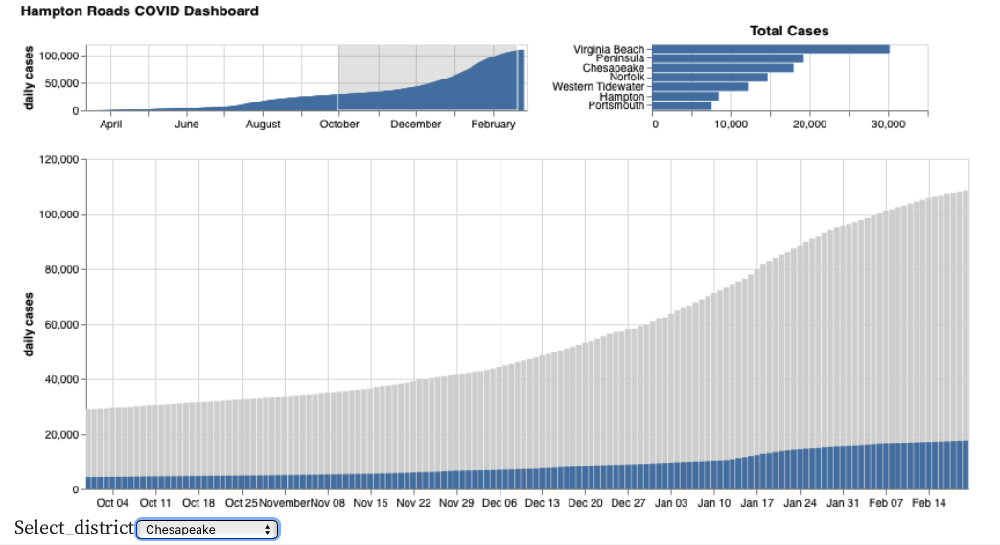

# Homework 3 - Dashboards and Interaction
**Due:** Tuesday, March 16, 2021 by 11:59pm

*Read the entire assignment before starting.* 

## Assignment 

In this assignment, we'll be continuing with the Virginia COVID dataset and building on some charts you created in HW1 and HW2.

Like with the previous assignments, you will be using an Observable notebook for this assignment.  In addition to creating the charts that are assigned, you must also include an explanation of the charts and how you have created them.  

Since you'll be using the same data as in HW1/HW2, you may want to just fork either your HW1 or HW2 notebook to get started.   You can use the same datafile as before, or you can download and attach a new one if you want to have updated stats.  Note that since you've made your HW1 public, you can also just import data variables from that notebook to your new one without having to attach the datafile.

In this assignment, you'll be creating both Vega-Lite and D3 charts.  You may create a separate notebook for each part.  As with HW2, the notebook that contains your charts should also contain the explanation for that chart (i.e., don't separate your report description from your chart).  You can tie multiple notebooks together in a collection, as I've done with our [CS 725/825, Spring 2021 collection](https://observablehq.com/collection/@weiglemc/cs-725-825-spring-2021).  Your notebooks should be ordered appropriately in the collection, and each notebook must include your name, HW3, and the question number that you are addressing with the notebook.

### Dataset

We will be using the same dataset as in HW1 and HW2:

> We are going to examine a dataset provided by the Virginia Department of Health (VDH) related to COVID-19. The dataset, [VDH-COVID-19-PublicUseDataset-Cases](https://data.virginia.gov/Government/VDH-COVID-19-PublicUseDataset-Cases/bre9-aqqr), has been made available through the [Virginia Open Data Portal](https://data.virginia.gov) and the [VDH's COVID-19 in Virginia page](https://www.vdh.virginia.gov/coronavirus/).  *Click the Export button on the dataset page to download the CSV.*

If you are using a collection, one option is to create a notebook that holds the various datasets and import them into the chart notebooks.  This way, you only need to attach the main datafile to a single notebook.  The data notebook needs to be made public so that you can import items into other notebooks.

### Part 1 - Vega-Lite Dashboard

Construct a Hampton Roads COVID Dashboard in Vega-Lite that includes a focus+context display of cumulative cases (or hospitalizations or deaths, your choice) over time and a bar chart of total cases (or hospitalizations or deaths) in each of the Hampton Roads health districts (as defined in HW1 and HW2).  (Below I'm using 'cases', but substitute hospitalizations or deaths as appropriate.)

In the larger focus display of cases over time (that will be zoomed based on the selection made in the smaller context chart), the HR total should be displayed in gray and the total for a single district should be layered in front of the gray (these can be bar charts or area charts). 

You can allow the user to select the health district in two different ways (only implement one of these):
* By using a menu selector to choose the health district name
* By clicking on a bar in the bar chart of total cases
  * if this option is chosen, the other (non-selected) bars should be shown in gray in the total cases bar chart

Since this is a dashboard, all of these elements should reside in the same Observable cell.

Here's a screenshot of my solution.  Yours doesn't have to look exactly the same, but this gives you an idea of what I'll be looking for.

*Extra credit:* Instead of cumulative data, calculate and visualize the new cases per day.

### Part 2 - D3 Interactions

For this part, you will be taking one of your D3 charts from HW2 and adding some interactive features.  You are only required to implement the changes for *one* of the following charts, but if you do more than one, I'll award *extra credit*.

**Chart 1** - Scatterplot 1 - total cases vs. deaths per locality
  * x: cases
  * y: deaths
  * each point represents the total number of cases and deaths for a particular locality

Add:
* tooltips
* a selector to choose the fields for the x and y axes (cases, hospitalizations, deaths)
* pan and zoom

**Chart 4** - Superimposed Line Chart - time series of total cases over time for certain health districts
  * filter for only these health districts: Western Tidewater, Chesapeake, Virginia Beach, Norfolk, Portsmouth, Hampton, Peninsula
  * x: time
  * y: cases per day summed over a district
  * color: health district

Add: 
* tooltips
* clickable legend that grays out the lines that are not selected
* pan and zoom (OR focus+context *for extra credit*)
 
**Chart 5** - Line Chart 2 - time series of total cases over time for a single health district
  * filter for only a single health district
  * x: time
  * y: cases per day summed over a district

Add: 
* tooltips
* selector to choose health district
* pan and zoom (OR focus+context *for extra credit*)

Note that there's a nice focus+context D3 example at https://observablehq.com/@d3/focus-context

## Submission

There are two steps to submission:

1. Publish your Observable notebook/collection to make it viewable.
  * If you are using a collection, you must Publish all notebooks in the collection and make the collection itself Public.
  * I will use the latest published/edited timestamp as your submission date. 
  * You can edit your notebook after publishing, but the changes will not be viewable until you "Re-publish" the notebook.

2. Submit the URL of your Observable notebook/collection in Blackboard:
  * Click on HW3 under Assignments.
  * Under "Assignment Submission", click the "Write Submission" button.
  * Copy/paste the URL of your Observable notebook/collection into the edit box. (If you have created a collection, you only need to provide the URL of the collection, not the individual notebooks.)
  * Make sure to "Submit" your assignment or I will not be able to find your notebook or grade your work.
