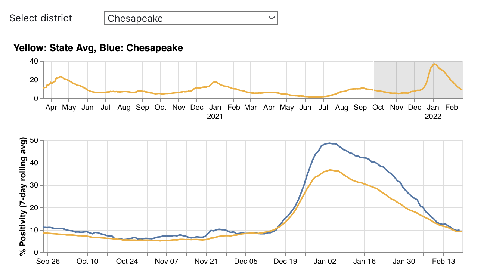

# Homework 4 - Dashboards and Interaction 
**Due:** Wednesday, March 16, 2022 by 11:59pm

*Read the entire assignment before starting.* 

## Assignment 

In this assignment, we'll be continuing with the Virginia COVID datasets from previous assignments.

Like with the previous assignments, you will be using an Observable notebook for this assignment.  In addition to creating the charts that are assigned, you must also include an explanation of the charts and how you have created them.  

In this assignment, you'll be creating both Vega-Lite and D3 charts.  You may create a separate notebook for each part.  The notebook that contains your charts should also contain the explanation for that chart (i.e., don't separate your report description from your chart).  You can tie multiple notebooks together in a collection, as I've done with our [CS 725/825, Spring 2022 collection](https://observablehq.com/collection/@weiglemc/cs-725-825-spring-2022).  Your notebooks should be ordered appropriately in the collection, and each notebook must include your name, HW4, and the question number that you are addressing with the notebook.

### Dataset

We will be using multiple datasets:

* testing per health district - https://data.virginia.gov/Government/VDH-COVID-19-PublicUseDataset-Tests_by-LabReportDa/3u5k-c2gr
* daily vaccines administered per locality - https://data.virginia.gov/Government/VDH-COVID-19-PublicUseDataset-Vaccines-DosesAdmini/28k2-x2rj  
OR
* weekly data of new {infections, hospitalizations, deaths} per Virginia health region - https://data.virginia.gov/dataset/VDH-COVID-19-PublicUseDataset-Cases-by-Vaccination/vsrk-d6hx

You may also need to use the Virginia population dataset developed at https://observablehq.com/@weiglemc/cs725-s22-virginia-population-data-manipulation to map health districts to their appropriate health region.
```
import {state_population} from "@weiglemc/cs725-s22-virginia-population-data-manipulation"
```

These datasets contain data similar to that displayed at the [VDH COVID-19 in Virginia pages](https://www.vdh.virginia.gov/coronavirus/see-the-numbers/covid-19-in-virginia/). You should use this data to sanity-check your charts.

### Part 1 - Vega-Lite Dashboard

Construct a Virginia COVID Dashboard in Vega-Lite with a drop-down menu allowing the user to choose a health district.  The dashboard must contain at least the following three charts:

1. selectable line chart of the 7-day rolling average of PCR positivity over time for the entire state
1. line chart containing one line for the 7-day rolling average of PCR positivity over time for the entire state and one line for the selected district - the interval selection in the chart 1 should zoom in on chart 2 (example below)
1. bar chart containing the total {vaccines, infections, hospitalizations, OR deaths} in each Virginia health region (same data as [HW2](HW2.md), Q8), sorted in descending order - the bar for the region containing the selected district should be highlighted in a different color

The charts should be arranged such that chart 1 is above chart 2, similar to 



Chart 3 should be to the right of charts 1 and 2.  You may add other charts in the area to the right of charts 1 and 2, but the total height should be the same as the combined height of charts 1 and 2.

Since this is a dashboard, all of these charts must reside in the same Observable cell.  Use the `width` variable to ensure that the entire dashboard can be displayed horizontally without the need for scrolling.

### Part 2 - D3 Interactions

For this part, you will be taking some of your D3 charts from [HW3](HW3.md) and adding interactive features. 

**Chart 1** - Horizontal Bar Chart - latest percent positivity for Hampton Roads health districts

Add:
* tooltips showing the percent positivity

**Chart 2** - Scatterplot - number of PCR tests administered vs. PCR positivity rate (latest report date)

Add: 
* tooltips showing the health district
 
**Chart 5** - Multi-Line Chart - time series of % PCR positivity for 3 health districts

Add: 
* tooltips showing the health district, date, % PCR positivity
* drop-down menu selectors to choose each of the three health districts (these can be Observable inputs)

### Extra Credit

Build the dashboard in Part 1 using D3 (in addition to the implementation in Vega-Lite).

I will give partial extra credit for a dashboard that contains just charts 1 and 2, but the interactions must work.

## Submission

There are two steps to submission:

1. Publish your Observable notebook/collection to make it viewable.
  * Set the Visibility as "Unlisted" rather than "Public"
  * If you are using a collection, you must Publish all notebooks in the collection and make the collection itself Public.
  * I will use the latest published/edited timestamp as your submission date. 
  * You can edit your notebook after publishing, but the changes will not be viewable until you "Re-publish" the notebook.

2. Submit the URL of your Observable notebook/collection in Blackboard:
  * Click on HW4 under Assignments.
  * Under "Assignment Submission", click the "Write Submission" button.
  * Copy/paste the URL of your Observable notebook/collection into the edit box. (If you have created a collection, you only need to provide the URL of the collection, not the individual notebooks.)
  * Make sure to "Submit" your assignment or I will not be able to find your notebook or grade your work.
